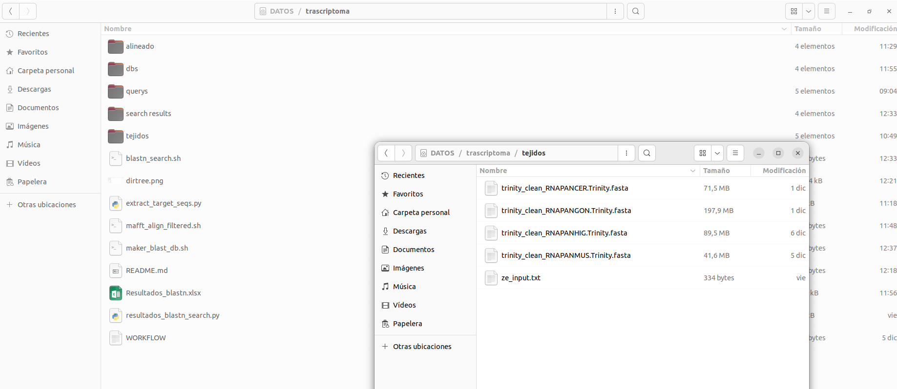
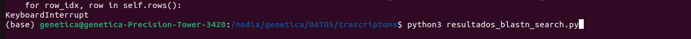
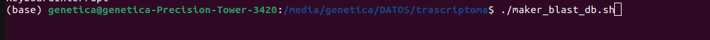

# Como usar scripts de Ubuntu

---

## La mayoría de scripts van a asumir que

1. Los corre desde terminal de ubuntu (shell o bash)

2. Asume que están instalados BLAST+, python3, mafft.
    2.1 python3 usa los paquetes openpyxl y biopython
3. Van a estar en un directorio que tenga los scripts y subdirectorios que van a tener los datos

---

Tipo así.



---

## Uso

En Ubuntu, desde el directorio de los scripts:
Tratar de correr un script que se llame $script.py$ significa que vamos a correr un script de python3 y sería escribir:

``` sh
python3 script.py
```


Si son de shell entonces tratar de correr un script de shell o bash que se llame $script.sh$ sería escribir: ./script.sh


---

## Scripts

- En orden de uso
  - maker_blast_db.sh
  - blastn_search.sh
  - resultados_blastn_search.py
  - extract_target_seqs.py
  - mafft_align.sh

---

## [maker_blast_db.sh](https://jovillarrealm.github.io/eDNA-empty/maker_blast_db.sh "downloadURL")

- Crea bases de datos en subdirectorios de la carpeta "dbs" a partir de cada archivo .fasta encontrado en una carpeta que sea dada por el usuario

- Primero, pide al usuario (y autocompleta) el nombre de la carpeta donde se encuentren los archivos .fasta a convertir

- Segundo, muestra cada archivo a ser convertido y pide el nombre de cada base de datos correspondiente

---

## [blastn_search.sh](https://jovillarrealm.github.io/eDNA-empty/blastn_search.sh "downloadURL")

- Asume que los .fasta query están en un subdirectorio 'querys' y las bases de datos en 'dbs'

- No pide nada.

- Hace busquedas con blastn con los archivos de query con las bases de datos puestas en la carpeta equivalente a "querys" y crea los resultados en archivos .out en la carpeta "search results" (usa formato 6 y un valor de $E_{value} = 1e-50$)

---

## [resultados_blastn_search.py](https://jovillarrealm.github.io/eDNA-empty/resultados_blastn_search.py "downloadURL")

- Recopila resultados de los .out que encuentre (en todo subdirectorio) en un .xlsx

---

## [extract_target_seqs.py](https://jovillarrealm.github.io/eDNA-empty/extract_target_seqs.py "downloadURL")

- Asume que hay un .txt en la carpeta donde están los tejidos que tiene las secuencias que van a ser extraidas

- Primero pide el nombre de la carpeta donde están los .fasta

- Segundo, pide el nombre de la carpeta donde van a quedar los resultados (los nombres de los resultados son "f_{NOMBRE_ORIGINAL}.fasta" )

---

## [mafft_align.sh](https://jovillarrealm.github.io/eDNA-empty/mafft_align.sh "downloadURL")

Alinea los archivos de la carpeta dada y deja los resultados en la carpeta "alineado"

---

## [Sakura](tamalamelematica/book/index.html)
